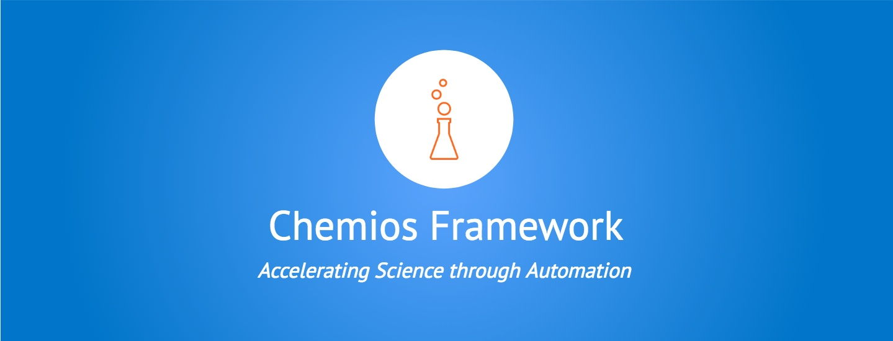

 **Chemios Framework** — Automate your laboratory through an easy-to-use software package.
 
 The Chemios Framework reduces the time to make discoveries by helping you automate tedious tasks. It has features for interfacing with laboratory equipment.

 The framework is written in python (the unoffical language of science), made open-source and is actively maintained. 

## Contents

 - 🛠️[Installation](#installation)
 - 👍 [Examples](#examples)
 - ⚙️ [Compatabile Equipment](#features)
 - 🎁 [Contributing](#contributing)


## 🛠️<a name="installation"></a> Installation

Watch the video guide here or follow the steps below to design and run your first experiment in minutes.

1. [Install python](https://www.python.org/downloads/) (version 3 or above) if you haven't already. Note that it is recommended to use python installed on the [cygwin](https://cygwin.com/install.html) terminal on Windows.
2. Open up your terminal and install the chemios package with the following command:
    ```bash
    pip install chemios
    ````
3. Now you can import the chemios package and begin to use it in python scripts.


## 👍 <a name="examples"></a> Examples

Interacting with a Chemyx Pump
```python
from chemios.components.pumps import Chemyx
from time import sleep

#Configuration for 10 mL Hamilton Glass Tight Syringe
syringe_type = {'manufacturer': 'hamilton', 
                'volume': 10 }

#Instantiate a Chemyx OEMs
C = Chemyx( model='OEM',
            address=1,
            syringe_type = syringe_type)

#Set the flowrate to infuse at 100 microliters per minute
rate = {'value': 100,
        'units': UM}                     
C.set_rate(rate=rate
            direction = 'INF')

#Run the pump for 5 seconds
C.run()
sleep(5)

#Stop the pump
C.stop()
```

## ⚙️ <a name="features"></a> Compatible Equipment

- Chemios currently works with the following types of devices:
     * Syringe Pumps: Harvard Apparatus, Chemyx, and New-Era
     * Spectrometers: Ocean Optics 
     * Temperature Controllers: Omega CN 9300 Series

- Roadmap:
     * Complete Unit Test Framework
     * Update Device Code
     * Create online documentation


## 🎁 <a name="contributing"></a> Contributing

We ❤️ contributors!

We are looking in particular for people to extend the framework to work with more types of laboratory equipment. To contribute, fork the repository, make your changes and submit a pull request. [This](https://gist.github.com/Chaser324/ce0505fbed06b947d962) is a nice set of instructions on how to do that.  We'll review the changes and add them to the library.

